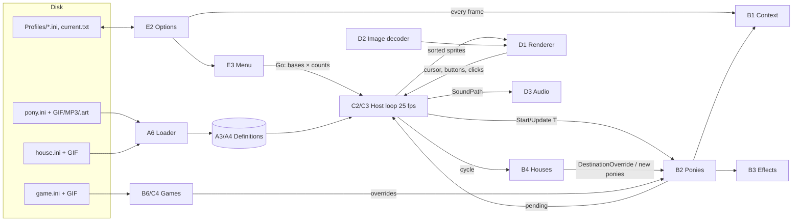

# 1. Architecture: Components and Interfaces

This chapter categorises the reference implementation (RI) into components, names the interfaces
between them, and proposes a decomposition for a new (Linux) implementation. Later chapters
specify each interface in detail.

---

## 1.1 Reference implementation at a glance

The RI is a .NET Framework 4.8 solution (runs on Linux via Mono) with three projects:

| Project            | Language | Role |
|--------------------|----------|------|
| **Desktop Sprites** | C#      | Generic, pony-agnostic sprite engine: host loop, sprite and renderer contracts, GIF decoding and animation model, rendering backends (WinForms layered window; GTK 2 for Mac/Linux), utility types. |
| **Desktop Ponies**  | VB.NET  | The application: content model and parsers, the pony simulation, desktop/game hosts, menu UI, options and profiles, two pony editors, debug monitors. |
| **Release Tool**    | C#      | Developer tool: image optimisation (gifsicle/pngout), cropping images and shifting image centers, packaging. Out of scope. |

## 1.2 Component catalogue

Components are grouped by *layer*. "Behavioral" components are fully specified by this document;
"platform" components are specified only by their contracts.

### Layer A — Content (behavioral)

| Component | RI location | Responsibility | Spec |
|-----------|-------------|----------------|------|
| A1 Line tokeniser | `IniLineParser`, `StringExtensions.SplitQualified` | Q / QB / B comma splitting (B = `{…}` only, quotes ordinary, used only by `game.ini` `Game`/`Position`/`Goal` lines; an unclosed `{` is retried once with `}` appended, so it absorbs the rest of the line), enum token maps | §3.3, §9.2.1 |
| A2 Typed field parser | `StringCollectionParser`, `ParseIssue`, `ParseResult` | Typed reading of fields with defaults, ranges, issue collection, fatal vs. fallback | §3.4–3.5 |
| A3 Pony definition model | `PonyBase`, `Behavior`, `BehaviorGroup`, `Speech`, `EffectBase`, `InteractionBase` | Immutable-at-runtime definitions; per-entity `TryLoad` and canonical `GetPonyIni` | Ch. 3 |
| A4 House definition model | `HouseBase` | `house.ini` model | Ch. 4 |
| A5 Game definition model | `Game` (loading part), `Team`, `Position`, `GoalArea`, `Ball` definitions | `game.ini` model | Ch. 9 |
| A6 Content loader | `PonyCollection` | Directory discovery, parallel loading, legacy migration, Random Pony separation, sorting | Ch. 2 |
| A7 Reference checker | `IReferential`, `Referential` | Editor-time validation of cross references | §3.14 |
| A8 Image metadata | `ImageSize`, `SpriteImage`, `CenterableSpriteImage` | Header-only image size; natural/custom centers | §7.3 |

### Layer B — Simulation (behavioral; platform-independent)

| Component | RI location | Responsibility | Spec |
|-----------|-------------|----------------|------|
| B1 World context | `PonyContext` | Shared settings, allowed/exclusion regions, cursor, sprite collection, pending sprites | §6.2 |
| B2 Pony instance | `Pony` | Behavior state machine, movement, bounds, following, speech, effects, interactions, special states, external control API | Ch. 6 |
| B3 Effect instance | `Effect` | Spawned effect sprites | §6.8 |
| B4 House instance | `House` | Visitor deploy/recall cycle | §6.13 |
| B5 Interaction record | `Interaction` | Initiator/targets bookkeeping | §6.10 |
| B6 Game engine | `Game`, `Ball`, `Team`, `Position`, `GoalArea`, `GameScoreboard` | Mini-game rules driving ponies via overrides | Ch. 9 |
| B7 Random source | `Rng` | Single shared uniform RNG | §6 notation |

### Layer C — Host (behavioral)

| Component | RI location | Responsibility | Spec |
|-----------|-------------|----------------|------|
| C1 Animation loop | `AnimationLoopBase` | Frame pacing with a configurable maximum frame rate (0 < cap ≤ 120, default 60; sleep for the rest of the interval, never catch up), elapsed-time clock with pause, queued add/remove, stable z-sort, start/finish lifecycle | §8.6 |
| C2 Pony host | `PonyAnimator` | Sets the frame cap to 25 fps (40 ms; every RI host inherits it); per-frame orchestration: pending sprites, cursor, option sync, drag, manual control, interaction rebuild, sounds, z-order, exit requests | §8.6–8.8 |
| C3 Desktop host | `DesktopPonyAnimator` | Context menus, add/remove ponies/houses, sleep-all, house cycling, options window | §8.8 |
| C4 Game host | `Game.GameAnimator` | Subclass of C3 created with adding/removing disabled: the pony menu keeps only Take/Release Control, Show Options, Return To Menu and Exit (the house menu is built but unreachable, since games have no houses). Replaces C3's per-frame context sync (so no house cycling) with option sync under game overrides, region = game screen, cursor avoidance off, then the game update. Draws score displays above all sprites; cleans up the game on finish | Ch. 9, §8.8.3 |
| C5 Sprite capability interfaces | `ISprite`, `ISpeakingSprite`, `IDraggableSprite`, `IExpireableSprite`, `ISoundfulSprite` | Contract between B and C/D | §7.1 |

### Layer D — Platform (contract only)

| Component | RI location | Responsibility | Spec |
|-----------|-------------|----------------|------|
| D1 Renderer / viewer | `ISpriteCollectionView`; `WinFormSpriteInterface` (+`AlphaForm`), `GtkSpriteInterface` | Transparent always-on-top surface, drawing frames into regions, speech bubbles, cursor & button polling, click events, context menus, focus | §7.6–7.8, §8.8 |
| D2 Image decoding | `GifImage`, `AnimatedImage`, `Frame`, `BitmapFrame`, `AlphaRemappingTable` | GIF → composited frames + timing; `.art` alpha maps | §7.4–7.5 |
| D3 Audio | NAudio in `PonyAnimator` | MP3 playback with volume | §8.7 |
| D4 Keyboard state | `KeyboardState` (Win32 `GetKeyState`) | Global key polling for manual control | §8.8.4 |
| D5 Window geometry | `Interop.Win32` (`WindowFromPoint`, `GetWindowRect`) | Foreign window rectangles for window avoidance/containment | §6.12.5 |
| D6 Display topology | WinForms `Screen` | Monitors, bounds, work areas, change notifications | §5.2 |

### Layer E — Application shell and tools (behavioral at the level of Chapter 8)

| Component | RI location | Responsibility | Spec |
|-----------|-------------|----------------|------|
| E1 Bootstrap | `Bootstrap`, `Program`; `MainForm.ProcessCommandLine` | `Bootstrap` (process entry): working directory, dependency check (sprite-engine library missing → error box, return without starting, exit status 0). `Program`: error handlers, UI launch, fatal/non-fatal error reporting, `error.txt` (unobserved background-task errors are only logged). `MainForm.ProcessCommandLine`: command-line arguments, run after the `Ponies` directory check (not on the macOS path) | §8.2–8.3, §8.13 |
| E2 Settings | `Options`, `Globals` | Option values, profiles, allowed area | Ch. 5 |
| E3 Menu | `MainForm`, `PonySelectionControl`, `FiltersForm`, `OptionsForm`, `MainWindow` (macOS) | Selection, filters, profiles, launch | §8.2–8.5 |
| E4 Screensaver | `MainForm` paths, `ScreensaverBackgroundForm` | `/s` mode | §8.11 |
| E5 House dialog | `HouseOptionsForm` | Edit/save `house.ini` | §8.9 |
| E6 Game selection | `GameSelectionForm`, `GameTeamControl` | Choose game and teams | Ch. 9 |
| E7 Editors | `PonyEditor/*`, `PonyEditor2/*` | Content authoring | §8.12 |
| E8 Monitors | `Monitoring/*` | Debug log / sprite table | — |
| E9 Community check | `CommunityDialog` | Remote link list / update check | out of scope |

## 1.3 Interfaces

| ID  | Between | Nature | Specified in |
|-----|---------|--------|--------------|
| I1  | Content files → A | File formats: `pony.ini`, `house.ini`, `game.ini`, legacy `interactions.ini`, `.art`, GIF/PNG, MP3 | Ch. 3, 4, 9; §7.4–7.5 |
| I2  | A → B | Definition objects (PonyBase etc.), including derived implicit behaviors | §3.15, Ch. 6 |
| I3  | E2 → B1 | Options → Context synchronisation every frame | §6.2, §5.1 |
| I4  | B ↔ C | Sprite contract: `Start(T)`, `Update(T)`, `Region`, `ImagePaths`, `FacingRight`, `ImageTimeIndex`, `PreventAnimationLoop`, `SpeechText`, `SoundPath`, `Drag`, `Expire()` / `Expired` | §7.1; `Drag` §8.8.2; `Expire()` / `Expired` §6.14.1, §8.6 |
| I5  | C/E, B4, B6 → B2 | External control API: `Sleep`, `Drag`, `DestinationOverride`, `MovementOverride`, `SpeedOverride`, `FollowTargetOverride`, writable `Location`, `SetBehavior`, `Speak`, `Expire`, `InitializeInteractions`; read-only queries `Region`, `Base`, `CurrentBehavior`, `Movement`, `AtDestination`, `IsBusy`, and the `Expired` event (see below) | §6.14, §6.13, Ch. 9 |
| I6  | B → C | Pending-sprite channel (effects, visitors spawned during update) | §6.1 |
| I7  | C → D1 | Renderer contract: open/close/show/hide/pause/resume, draw sorted sprites, cursor, buttons, focus, click events, context menus, topmost, taskbar | §7.6, §8.8 |
| I8  | D2 → D1 | Animated image: frames, `FrameIndex(τ, preventLoop)`, size, loop count | §7.4 |
| I9  | C → D3 | "Start this file now at volume v"; completion tracking | §8.7 |
| I10 | E2 ↔ disk | Profile files and `current.txt` | §5.3 |
| I11 | E1 ↔ OS | Command line, exit status, `error.txt` | §8.3, §8.13 |

I5 members not covered by §6.14.1:

* **`Location`** (write): replaces the pony's anchor `L` at once. Nothing is clamped or checked,
  and no behavior, destination or flag changes. The cached `Region` stays stale until the
  pony's next update. If it is set before `Start`, it replaces the random spawn point (§6.15).
  RI writers: house visitor deploy (door position, §6.13), game ball placement at
  initialisation and at ReadyBalls (§9.3, §9.5.1), and game push-apart (§9.5.4).
* **`AtDestination`**: true iff a destination was set in the last step and
  `|L − destination|² < ε`. Games poll it in WaitForPositions.
* **`Movement`**: the last step's movement vector. Games use it for the ball's bounce direction
  and re-apply it as `MovementOverride` after switching the ball's behavior.
* **`CurrentBehavior`**: the active behavior. Games use it for the ball's base speed and speed
  class.
* **`IsBusy`** (§6.4): read by house recall.

## 1.4 Data flow



## 1.5 Threading model (RI, informative)

* **UI thread**: menu, dialogs, renderer (all renderer calls are marshalled onto it).
* **Animation thread**: the host loop; owns the sprite collection (guarded by a reader/writer
  lock) and calls into the renderer synchronously.
* **Thread pool**: content loading (parallel per directory), image pre-loading, and every
  context-menu handler. Both renderer backends hand each menu activation to the pool; only
  Show Options and house Edit marshal back to the UI thread.

Sprite updates are single-threaded: every sprite is updated on the animation thread in
collection order. Ponies read each other's state directly (follow targets, interaction
participants, avoidance) — the order of updates within a frame therefore affects results by at
most one step.

RI defect: menu handlers change simulation state from pool threads without synchronising with
the animation loop, so the changes land at arbitrary points within a frame:

* Sleep/Pause and Sleep/Pause All write `Sleep` directly. Sleep/Pause All enumerates the ponies
  under the collection's read lock only, which does not exclude the update pass.
* Take/Release Control replaces the controlled-pony slot and clears `SpeedOverride` and
  `DestinationOverride` on the previous pony. The animation thread reads the slot and writes
  the same overrides every frame, so a release that races a frame can leave the old pony with
  stale overrides.
* Add Pony appends to the plain pending-sprite list that the animation thread copies and clears;
  an addition may be lost. Add House builds the house, initialises its visitor list and
  teleports it on the pool thread, then queues it. Remove and Remove Every enqueue removals onto
  the action queue without a lock (only draining it takes the write lock).
* House Remove expires the house on the pool thread, so its expiry handler (clears the
  `DestinationOverride` of every pony it tracks and empties its tracking sets, §8.8.3) races
  the house cycle and pony updates; only the resulting removal is queued.
* Return To Menu and Exit run the whole finish sequence on the pool thread: set the exit
  request, expire every sprite, dispose the loop and join the animation thread.

**Recommendation:** post every menu action to the simulation thread as a command and apply it
at a defined point at the start of the next frame. Never change sprite state or simulation
collections from another thread.

## 1.6 Recommended decomposition for a new implementation

```
content/      tokeniser, typed field parser, pony/house/game schemas, loader, canonical writer
model/        immutable definitions + derived data (implicit behaviors, effect lookup by behavior)
sim/          Context, Pony, Effect, House, Interaction, Game rules — pure logic,
              driven only by (time, input snapshot, RNG); no I/O
host/         frame loop, sprite collection, z-sort, drag/hover input plumbing, sound requests
render/       backend(s): X11 overlay, Wayland layer-shell, …; GIF decoding, .art application
audio/        MP3 decoding + mixing
shell/        CLI, menu UI, options & profiles persistence, screensaver mode
```

Design notes:

* Inject the RNG and the clock into `sim/` so behavior can be unit-tested and replayed
  deterministically (the RI uses a single unseeded global RNG).
* Keep the 40 ms fixed simulation step and the 25 fps host cadence; many content timings
  (GIF delays, durations) were tuned against them (§6.3, §7.4.2).
* Treat every "RI defect / Recommendation" note as a conscious decision point; Chapter 10
  collects them.
