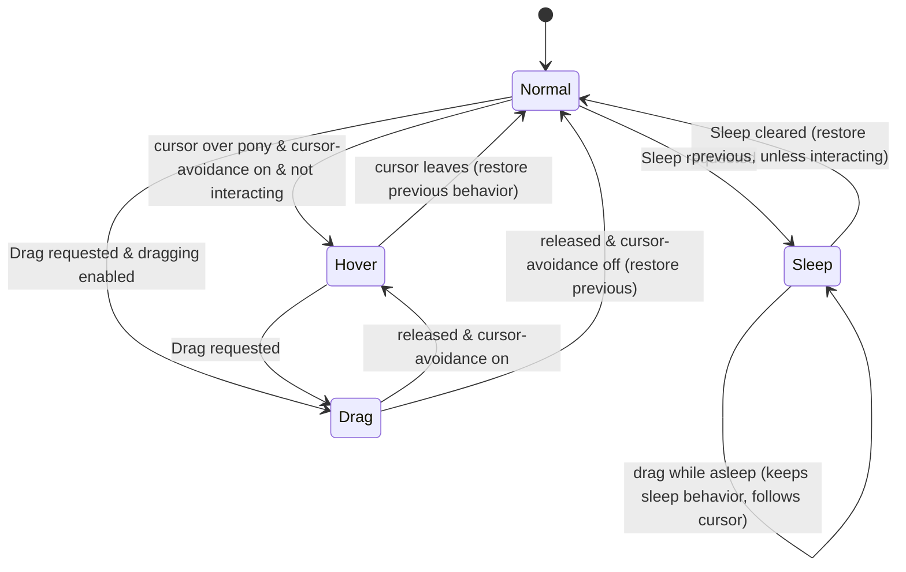

# 6. Simulation Model (Pony Behavior Engine)

This chapter specifies how a pony instance behaves over time: how behaviors are chosen, how the
pony moves, follows, speaks, spawns effects, interacts, reacts to the mouse, and stays on screen.
It is platform-independent; rendering is in [Chapter 7](07-images-and-animation.md) and the host
application in [Chapter 8](08-application-shell.md).

Notation: `U` is a fresh uniform random number in [0, 1). `coin` is `U < 0.5`. `ε = 2⁻²⁴`.
`|v|` is vector length. All distances are in **screen pixels**; the y axis points **down**.

---

## 6.1 Entities

| Entity              | Description |
|---------------------|-------------|
| **PonyBase**        | Immutable definition loaded from `pony.ini` (Chapter 3). |
| **Pony** (instance) | A live sprite modelled on a PonyBase. Several instances of one base may coexist. |
| **EffectBase**      | Definition of an effect (Chapter 3 §3.10). |
| **Effect**          | A live effect sprite spawned by a pony (§6.8). |
| **HouseBase / House** | A house definition (Chapter 4) and its live sprite, which periodically spawns and recalls ponies (§6.13). |
| **Context**         | Shared, per-session settings and world state, read by every sprite (§6.2). |
| **Interaction**     | Per (initiator instance × interaction definition) runtime record (§6.10). |

All sprites live in one **sprite collection** owned by the host loop. Sprites spawned during an
update (effects, house visitors) are put into the context's *pending* list and added by the host
at the start of the next frame (§6.14).

## 6.2 Context (world settings)

Every pony and effect reads these values. The host refreshes them from the user options **every
frame**, so option changes apply live.

| Context value            | Source option (Chapter 8)        | Use |
|--------------------------|----------------------------------|-----|
| EffectsEnabled           | Pony effects enabled             | §6.8 |
| SpeechEnabled            | Pony speech enabled              | §6.9 |
| InteractionsEnabled      | Pony interactions enabled        | §6.10 |
| RandomSpeechChance       | Speech probability (0–1)         | §6.9 |
| CursorAvoidanceEnabled   | Cursor avoidance enabled         | §6.11, §6.12 |
| CursorAvoidanceRadius    | Cursor avoidance size (px)       | §6.12.6 |
| DraggingEnabled          | Pony dragging enabled            | §6.11 |
| PonyAvoidanceEnabled     | Ponies avoid each other          | §6.12.5 |
| WindowAvoidanceEnabled   | Avoid windows (Windows-only in RI) | §6.12.5 |
| StayInContainingWindow   | Window containment (Windows-only in RI) | §6.12.5 |
| TimeFactor               | Time scale, 0.1–10               | §6.3 |
| ScaleFactor              | Sprite scale, 0.25–4             | §6.2.1 |
| Region                   | Allowed area (screen rectangle)  | §6.12 |
| ExclusionZone            | Normalised sub-rectangle of Region to avoid | §6.12 |
| TeleportationEnabled     | Teleport back into bounds        | §6.12.3 |
| CursorLocation           | Mouse position, updated each frame | §6.11 |
| Sprites                  | The live sprite collection       | follow/interaction/avoidance lookups |

**Exclusion region** (pixels) is computed from the normalised zone `(x, y, w, h)` ∈ [0,1]:
`round(Region.x + Region.w·x, Region.y + Region.h·y, Region.w·w, Region.h·h)`, then trimmed so it
does not extend past Region's right/bottom edges. A zone of zero size means "no exclusion".

### 6.2.1 Geometry of a pony

* **Location** `L` — a floating-point screen point: where the *anchor* of the current image is.
* **Current image** — the right or left image (by facing) of the *image behavior*: the visual
  override behavior if one is set (§6.7.3), else the current behavior.
* **Anchor** `A` — the image's custom center if set, else its natural center (§7.3), in image
  pixels.
* **Sprite rectangle** (float) `S = (L − A·k, size·k)` where `k` = ScaleFactor and `size` is
  the image's pixel size (from the file header; first frame / logical screen size).
* **Region** (integer, reported to the renderer) — `S` with its origin rounded to nearest
  (ties to even) and its size truncated toward zero. It is recomputed whenever the location
  changes (§6.6.5).

Because the location is the anchor point, changing image (behavior change or facing flip) keeps
the anchor fixed on screen and moves the rectangle around it.

## 6.3 Time model

* The host supplies a monotonically increasing **external time** `T` (elapsed real time since
  the animation started, paused while the animation is paused) to every sprite once per frame.
* Each pony and effect advances an **internal clock** `t` in **fixed steps of 40 ms**
  (25 steps per simulated second).
* **TimeFactor** `f` scales simulated time: one step is taken per `40 ms / f` of external time.
  `f = 2` runs everything twice as fast.
* `Update(T)`: while the sprite is not expired and `T − lastUpdate ≥ 40 ms / f`:
  `lastUpdate += 40 ms / f`; perform one STEP (§6.15). There is no cap on catch-up steps.
* **Start(T₀)** sets `t = lastUpdate = T₀` (a pony's internal clock starts at the external
  time of its start; only differences matter).
* **Image time index** (drives animation frames, Chapter 7) = `t − behaviorStartTime` for
  ponies, `t − spawnTime` for effects. It therefore restarts at 0 on every behavior change and
  advances in 40 ms quanta of simulated time.
* All durations in definitions (behavior duration, effect duration, repeat delay, interaction
  cool-down, speech duration) are in **simulated** seconds.

The house cycle (§6.13) and the host loop use external time, not simulated time.

## 6.4 Pony instance state

| Variable                         | Initial          | Meaning |
|----------------------------------|------------------|---------|
| `t`, `lastUpdate`                | set by Start     | §6.3 |
| `current`                        | —                | current behavior |
| `behaviorStart`                  | —                | internal time the behavior began |
| `desiredDuration`                | —                | how long `current` should run |
| `visualOverride`                 | none             | behavior lending its images (§6.7.3) |
| `facingRight`                    | false            | |
| `L` (location)                   | unset (NaN)      | §6.2.1 |
| `movement`                       | (0,0)            | displacement applied per step |
| `needFreeMovement`               | false            | a free-movement vector must be generated |
| `behaviorChangedThisStep`        | false            | |
| `followTarget`                   | none             | pony instance being followed |
| `destination`                    | none             | recomputed every step |
| `lastStepInBounds`               | true             | |
| `reboundCooldownEnd`             | 0                | §6.12.5 |
| `reboundingIntoRegion`           | false            | §6.12.4 |
| `allowingNaturalReturn`          | false            | §6.12.2 |
| `speechStart`                    | −10 s            | |
| `speechDuration`                 | 0                | |
| `speechText`                     | none             | currently displayed bubble text |
| `soundToStart`                   | none             | one-shot, cleared at the start of each Update |
| `repeatingEffects`               | []               | (effectBase, lastExternalStart, lastInternalStart) |
| `effectsUntilBehaviorEnd`        | []               | effects with Duration 0 |
| `activeEffects`                  | {}               | all live effects spawned by this pony |
| `interactions`                   | []               | usable interactions (§6.10.1) |
| `currentInteraction`             | none             | |
| `interactionCooldownEnd`         | 0                | |
| `inHover`, `inDrag`, `inSleep`   | false            | special states (§6.11) |
| `behaviorBeforeSpecial`          | none             | behavior to restore after a special state |
| `atOverride`, `inRegionFlag`     | unset            | tri-state flags (unset / true / false) for §6.12.3 and §6.14.1 |
| `expired`                        | false            | |
| **Externally controlled:**       |                  | |
| `Sleep`, `Drag`                  | false            | requested special states |
| `DestinationOverride`            | none             | §6.14.1 |
| `MovementOverride`               | none             | §6.14.1 |
| `SpeedOverride`                  | none             | §6.14.1 (px/s) |
| `FollowTargetOverride`           | none             | §6.14.1 |

Derived per instance at construction (Chapter 3 §3.15): `sleepBehavior`,
`hoverBehavior[group]`, `dragBehavior[group]` for every group number in use,
`hasStationary` (any behavior with Speed 0), `hasMoving` (any with Speed > 0).

**IsBusy** = `currentInteraction ≠ none` or `inHover` or `inDrag` or `inSleep` or
`MovementOverride ≠ none` or `DestinationOverride ≠ none`.

**currentGroup** = `current.Group` (or the first behavior's group before any behavior is set).

## 6.5 Behaviors

### 6.5.1 Entering a behavior — `SetBehavior(b, speakStart)`

`b` may be *none*, meaning "choose at random".

1. `followTarget ← none`, `destination ← none`, `needFreeMovement ← true`,
   `behaviorChangedThisStep ← true`.
2. `current ← b`, or `RandomCandidate(no filter)` (§6.5.2) if `b` is none. (The candidate is
   chosen while the *old* behavior still defines `currentGroup`.)
3. `behaviorStart ← t`.
4. `desiredDuration ← 0` if `inHover or inDrag or inSleep`, else
   `MinDuration + U·(MaxDuration − MinDuration)`.
5. Acquire a follow target (§6.7.2).
6. Expire every effect in `effectsUntilBehaviorEnd` and clear the list; clear
   `repeatingEffects`.
7. If `speakStart` and `current.StartSpeech` resolves (§3.14), speak it (§6.9).

Effects of the new behavior are **not** started here; they start in the same step's state
update only for certain transitions (§6.8.1).

### 6.5.2 Random candidate selection — `RandomCandidate(filter)`

Let `source` = all behaviors (file order), optionally restricted by `filter`. Build the candidate
list `C` by the first non-empty of:

1. `source` ∩ {not Skip} ∩ {Group = 0 or Group = currentGroup} ∩ {target reachable};
2. `source` ∩ {not Skip} ∩ {Group = 0 or Group = currentGroup};
3. `source` ∩ {not Skip};
4. `source`;
5. all behaviors.

*Target reachable*: the behavior's target mode is not Pony, or at least one **other**,
non-expired pony instance whose directory name equals the behavior's FollowTarget exists.

Then pick by weight:

* `|C| = 1` → that behavior.
* Otherwise `r ← U · Σ Chance(C)`; walk `C` in file order accumulating Chance; return the first
  behavior at which the running sum is `≥ r`.

Consequences: the current behavior may be re-selected; if every candidate has Chance 0, the
**first candidate in file order** is always chosen.

Filters used elsewhere: *stationary* (Speed = 0) and *moving* (Speed > 0).

### 6.5.3 Duration and expiry

A behavior **expires** in the step where `(t − behaviorStart) > desiredDuration` (strictly).
Since steps are 40 ms, a duration of 0 lasts exactly one step.

While the pony is in a special state (hover, drag, sleep) or seeking a custom destination
(§6.12.3, §6.14.1), every step applies **extend**:
`desiredDuration ← max(desiredDuration, t − behaviorStart)`, so the behavior cannot expire.
When the extension stops, the behavior expires on the next step.

On expiry (§6.16, STEP 7):

1. `link ← resolve(current.LinkedBehavior)`.
2. If `link` is none, end the current interaction normally (`EndInteraction(forced=false,
   reset=false)`, §6.10.4) — reaching the end of a chain ends one's participation.
3. If `current.EndSpeech` resolves, speak it.
4. `SetBehavior(link, speakStart=true)` (random if no link).
5. If the **new** behavior has neither a resolvable StartSpeech nor a resolvable EndSpeech, then
   with probability RandomSpeechChance speak a random line (§6.9).

## 6.6 Movement

### 6.6.1 Speed

`speedPerStep = (SpeedOverride if set, else current.Speed × 1000/30) / 25` pixels per step.
Speed is never multiplied by ScaleFactor.

### 6.6.2 Free movement vector — `FreeMovement(preserveDirections)`

Used when the behavior has no destination.

1. `moves ← current.Movement ∩ {H, V, D}` (special movements contribute nothing).
   `s ← speedPerStep`. If `moves` is empty or `s = 0`: `movement ← (0,0)`; done.
2. Choose uniformly among the axis kinds present in `moves`, considered in the order H, V, D.
3. `wasRight ← movement.x > 0 or (movement.x = 0 and coin)`;
   `wasDown ← movement.y > 0 or (movement.y = 0 and coin)`.
4. Vector:
   * H → `(s, 0)`; V → `(0, s)`;
   * D → `(s·sin θ, s·cos θ)` where θ is measured from the downward vertical:
     * Movement `Diagonal_Vertical`: θ ∈ U[15°, 45°) (steep: 45°–75° above horizontal)
     * Movement `Diagonal_horizontal`: θ ∈ U[105°, 135°) (shallow: 15°–45° from horizontal)
     * Movement `Diagonal_Only` or `All`: θ ∈ U[15°, 75°)
5. Signs and facing:
   * If `preserveDirections`: negate x if its sign disagrees with `wasRight`; negate y if its
     sign disagrees with `wasDown`. Facing unchanged.
   * Else if `allowingNaturalReturn` (§6.12.2): let `d = InRegionDestination()`; if `d` exists,
     point x toward `d.x` and y toward `d.y` (x positive iff `d.x > L.x`, y positive iff
     `d.y > L.y`). `facingRight ← movement.x > 0`.
   * Else: `facingRight ← coin`; if facing left negate x; with probability ½ negate y.

`preserveDirections` is true exactly when no behavior change happened in this step (a free
vector requested after, e.g., a follow target disappeared).

### 6.6.3 Movement update — once per step (§6.16, UpdateState 5)

```
if inHover or inDrag or inSleep:
    movement ← (0,0)
elif MovementOverride is set:
    movement ← MovementOverride; clear MovementOverride; needFreeMovement ← false
    normalise to exactly speedPerStep (see below, "force")
elif destination is set:
    movement ← destination − L
    normalise, capped at speedPerStep
elif needFreeMovement:
    FreeMovement(preserveDirections = not behaviorChangedThisStep); needFreeMovement ← false
(otherwise movement is unchanged from the previous step)

normalise: if |movement| > ε:
    facingRight ← movement.x > 0
    if |movement| > speedPerStep or force: movement ← movement / |movement| × speedPerStep
```

Notes:

* When seeking a destination closer than one step, the pony lands exactly on it.
* A pony moving exactly vertically toward a destination faces **left** (`x > 0` is false).
* Speed 0 with a destination yields zero movement: the pony stays put.

### 6.6.4 Facing

Facing changes only: when a movement vector is normalised toward a destination/override
(§6.6.3), on free-movement generation without preservation (§6.6.2), on rebounds and boundary
snaps when the resulting `movement.x ≠ 0` (§6.12), and never otherwise (a stationary behavior keeps
the previous facing).

### 6.6.5 Location update — once per step (§6.16, UpdateState 7)

```
if inDrag:
    L ← CursorLocation           # the anchor follows the cursor; no bounds applied
else:
    L ← L + movement
    recompute Region
    if destination is none and (lastStepInBounds or not SnapToBoundaryIfOutside()):
        Rebound()                # §6.12.4–6.12.6
S ← sprite rectangle
lastStepInBounds ← Region(context) ⊇ S and S ∩ exclusion = ∅
if lastStepInBounds or S ∩ Region(context) = ∅:
    reboundingIntoRegion ← false; allowingNaturalReturn ← false
recompute Region
```

## 6.7 Targets and following

### 6.7.1 Destination — once per step (§6.16, UpdateState 4)

Skipped if a destination was already set this step (by an override, §6.14.1, or a return-to-zone,
§6.12.3). Otherwise:

1. If `FollowTargetOverride` is set and `followTarget` is set: `destination ← followTarget.L`.
2. Else if `followTarget` is set and its location is defined:
   `offset ← (TargetX, TargetY)`; if FollowOffsetType is `Mirror` and the **target** faces left,
   `offset.x ← −offset.x`; `destination ← followTarget.L + offset`. (Offset in unscaled pixels.)
3. Else if the target mode is Point:
   `destination ← (Region.x + TargetX/100 · Region.w, Region.y + TargetY/100 · Region.h)`.
4. Otherwise no destination.

The destination is re-evaluated every step, so a followed pony is tracked continuously. Arrival
does not end the behavior: the pony keeps tracking until the behavior's duration expires.

### 6.7.2 Acquiring a follow target (in SetBehavior)

Only if `followTarget` is none and `current.FollowTarget` is non-empty. Candidates must be other,
non-expired instances whose directory equals FollowTarget (case-sensitive):

1. If in an interaction:
   * as **initiator** → uniform among the interaction's *involved targets* that qualify;
   * as **target** → if FollowTarget equals the initiator's directory, follow the initiator;
     otherwise uniform among involved targets other than self that qualify.
2. If still none → uniform among all other qualifying instances in the sprite collection.
3. If none exist → no follow target (the behavior moves freely, §3.9.3).

Note: when an interaction starts, the initiator enters its behavior *before* the targets have
joined, so its first behavior falls through to rule 2 (any qualifying instance). Later behaviors
in the chain see the populated involved-target set.

Each step, a follow target that has expired is dropped (§6.16, UpdateState 1). A `FollowTargetOverride`
that is set and not expired replaces `followTarget` every step.

### 6.7.3 Visual override (borrowed images)

Evaluated every step after the movement update. Applies when `followTarget` is set **or** the
current behavior is in Point mode; otherwise `visualOverride ← none`.

```
prev ← visualOverride; moving ← |movement| ≠ 0
if visualOverride set and (visualOverride.Speed = 0) ≠ (not moving): visualOverride ← none
if not current.AutoSelectFollowImages:
    visualOverride ← resolve(moving ? FollowMovingBehavior : FollowStoppedBehavior)   # may be none
if visualOverride is none:
    if not moving:
        if not hasStationary: visualOverride ← prev
        if still none: visualOverride ← RandomCandidate(stationary)
    else:
        if not hasMoving: visualOverride ← prev
        if still none: visualOverride ← RandomCandidate(moving)
```

So an automatically chosen image behavior is kept as long as the moving/stopped state does not
change, and re-drawn (weighted, group-aware) when it does. Only the images are borrowed;
PreventAnimationLoop and everything else still come from `current`. The image time index is not
reset when the override changes.

## 6.8 Effects

### 6.8.1 When effects start

The effects of the current behavior (all effect definitions whose BehaviorName equals
`current.Name`, in file order) start during the step's state update **only if** in that step the
behavior expired naturally, or the pony left the sleep, hover or drag state, or the update was
triggered by an external `SetBehavior` call or by `Start`. Consequently:

* behaviors entered via an **interaction start**, a **custom-destination switch** or **entering**
  a special state do **not** start their effects (RI behavior; implementers MAY start effects on
  every behavior change but should be aware this changes visuals for some content);
* behaviors reached by a link (natural expiry) do.

If effects are disabled in the context, nothing is spawned (repeat bookkeeping still happens).

For each effect definition `E` to start:

* spawn one instance now (§6.8.2) with zero offset;
* if `E.RepeatDelay > 0`, record `(E, lastExternalStart = lastUpdate, lastInternalStart = t)` in
  `repeatingEffects`.

### 6.8.2 Spawning an instance

* Facing: the instance faces the way the pony faces at spawn; it never changes afterwards.
* Placement/Centering: taken from the Right or Left variants according to that facing.
* Lifetime: if `E.Duration = 0` the instance is put in `effectsUntilBehaviorEnd` (expired on the
  next `SetBehavior`); otherwise it expires once its own age exceeds `E.Duration`.
* Position (top-left, integer), computed at spawn and — if `E.Follow` — again every frame:

  ```
  P ← pony sprite-rectangle origin (float) [+ spawn offset]
  Z ← pony Region size (integer, already scaled)
  e ← effect image size (unscaled) × ScaleFactor
  topLeft ← round( P + (Z.w·wx(Placement), Z.h·wy(Placement)) − (e.w·wx(Centering), e.h·wy(Centering)) )
  ```
  with the weights of §3.10 (`round` = nearest, ties to even).
* The instance's clock starts at the pony's internal time of the spawn and its external
  last-update time at the step's external time, so it ages consistently even though it is added
  to the sprite collection at the start of the next frame.
* The instance is added to the pony's `activeEffects`; when the pony expires, all its active
  effects expire.

### 6.8.3 Repeats

Every step (after the location update), for each repeating record `(E, extStart, intStart)`:

```
next ← intStart + E.RepeatDelay
while t ≥ next:
    offset ← −movement × ((t − next) / 40 ms)        # where the pony was at time `next`
    extStart ← extStart + E.RepeatDelay / TimeFactor
    spawn instance of E with clock start `next`, external start `extStart`, spawn offset `offset`
    intStart ← next; next ← next + E.RepeatDelay
store (E, extStart, intStart)
```

Repeats stop when the behavior changes (the list is cleared in SetBehavior).

### 6.8.4 Effect sprite update

```
Update(T):
    if expired: return
    while T − lastUpdate ≥ 40 ms / f: lastUpdate += 40 ms / f; t += 40 ms
    if E.Follow: re-anchor to the parent pony (formula above, no offset)
    elif being dragged: topLeft ← CursorLocation − (unscaled image size)/2
    if E.Duration > 0 and (t − spawnTime) > E.Duration: expire
```
Effects are draggable by the user (§6.11); a following effect snaps back to its anchor.

## 6.9 Speech

### 6.9.1 `Speak(line)`

```
if not SpeechEnabled: return
if line is none (random request):
    if the pony has no speeches: return
    if currentInteraction ≠ none or followTarget ≠ none: return
    if t − (speechStart + speechDuration) < 10 s: return
    pool ← speeches with Skip = False and (Group = 0 or Group = current.Group)
    if pool is empty: return
    line ← uniform choice from pool
speechStart ← t
speechText ← DisplayName + ": \"" + line.Text + "\""
speechDuration ← 0.5 s + length(speechText) / 15 s       # characters of the full string
soundToStart ← line.SoundFile (may be none)
```

* Explicitly referenced lines (start/end speeches) bypass the random restrictions — only
  SpeechEnabled is checked.
* A new speech replaces any bubble currently shown.
* The bubble is hidden in the first step where `t − speechStart > speechDuration`.
* `soundToStart` is reported to the host for the frame in which it was set and cleared at the
  start of the next `Update`. If several steps in one frame each speak, only the last sound is
  reported.

### 6.9.2 Speech triggers

| Trigger                                                       | Line |
|---------------------------------------------------------------|------|
| Behavior entered with `speakStart = true` and StartSpeech resolves | StartSpeech |
| Behavior expired naturally and EndSpeech resolves             | EndSpeech (then usually overwritten if the next behavior has a StartSpeech) |
| After natural expiry, new behavior has no start/end speech, with probability RandomSpeechChance | random |
| Entering hover state                                          | random |
| Entering sleep via a behavior whose Movement is `Sleep`        | that behavior's StartSpeech |
| Entering drag via a behavior whose Movement is `Dragged`       | that behavior's StartSpeech |
| Interaction start (initiator and each target)                 | the chosen behavior's StartSpeech |
| Host request (e.g. games, §9)                                 | given line |

`speakStart` is true for: random/linked behavior after expiry, the initial behavior at Start,
interaction behaviors, and the sleep/drag cases above. It is false when restoring a behavior
after a special state, when entering hover, and for custom-destination switches.

## 6.10 Interactions

### 6.10.1 Building the usable list

Rebuilt for **every** pony whenever any pony is added to or removed from the sprite collection.
For each interaction definition `I` of the pony's base (file order):

* `targets ←` every pony instance other than this one whose directory ∈ `I.Targets` and whose
  base has at least one behavior named in `I.Behaviors` (any group).
* Skip `I` if `targets` is empty, or if `I.Activation = All` and some name in `I.Targets` has no
  instance in `targets`.
* Otherwise keep `(I, targets)` (order of `targets` = order in the sprite collection).

### 6.10.2 Starting — every step (§6.16, STEP 6)

```
if not InteractionsEnabled or IsBusy or t < interactionCooldownEnd: return
for each usable (I, targets) in order:
    if U > I.Chance: continue
    trigger, available ← FindTrigger(I, targets)
    if trigger is none: continue
    Start(I, trigger, available)
```

`HasAllowed(p)` = pony `p` owns a behavior whose name is in `I.Behaviors` and whose group is 0
or `p`'s current group. `InRange(p)` = `|L − p.L| ≤ I.Proximity` (inclusive).

`FindTrigger`: first require `HasAllowed(self)`, else none. Then by activation:

* **One** — the first target (in order) that is not busy, `HasAllowed`, and `InRange`.
* **Any** — `available` = all targets that are not busy and `HasAllowed`; trigger = the first
  of those that is `InRange`; none if no available target is in range.
* **All** — if **any** target instance is busy or lacks `HasAllowed` → none (note: this means
  *every* instance of every listed pony must be free, not just one per name); trigger = the
  first target in range, or none.

Targets' own cool-downs are **not** checked: a pony in cool-down cannot initiate but can be a
target.

RI quirk: the loop does not stop after starting an interaction; a later interaction in the same
step may also start and overwrite `currentInteraction`. **Recommendation:** stop after the
first successful start.

### 6.10.3 Start(I, trigger, available)

1. `currentInteraction ← record(I)`; record.initiator ← self; record.trigger ← trigger.
2. Self: `SetBehavior(uniform choice among own behaviors named in I.Behaviors allowed by the
   current group, speakStart=true)`. (Uniform — Chance is ignored.)
3. Participants by activation: **One** → `trigger`; **Any** → every pony in `available`;
   **All** → every instance in `targets`.
   Each participant: `currentInteraction ← record`, add itself to `record.involved`, then
   `SetBehavior(uniform choice among *its own* allowed behaviors named in I.Behaviors, true)`.

Participants then run their behaviors (and links) independently. Follow targets inside an
interaction prefer fellow participants (§6.7.2). There is no synchronisation of durations.

### 6.10.4 Ending — `EndInteraction(forced, resetBehavior)`

```
if currentInteraction is none: return
if forced and record.initiator exists and self ≠ record.initiator:
    record.initiator.EndInteraction(forced, resetBehavior); return     # cancel goes via the initiator
if self is record.initiator:
    record.initiator ← none
    for each p in the record's target list whose currentInteraction is this record:
        p.EndInteraction(forced, resetBehavior)
else:
    remove self from record.involved
delay ← I.ReactivationDelay; if forced: delay ← min(delay, 30 s)
interactionCooldownEnd ← t + delay
currentInteraction ← none
if resetBehavior: SetBehavior(none, false)
```

Ending paths:

| Cause | Call |
|-------|------|
| A participant's behavior expires with no link (end of chain) | `(false, false)` — if it is the initiator, every remaining participant leaves too, but **keeps running its current behavior** |
| The user starts dragging a participant | `(true, true)` — all participants switch to random behaviors |
| A participant receives a custom destination (manual control, house recall, game) | `(true, false)` |
| Host calls `SetBehavior` on a participant | `(true, false)` |

Entering sleep does **not** end an interaction (the sleeper simply stays busy).

## 6.11 Special states: hover, drag, sleep



### 6.11.1 Sleep — every step (§6.16, STEP 2)

```
if Sleep and not inSleep:
    inSleep ← true; behaviorBeforeSpecial ← current
    SetBehavior(sleepBehavior, speakStart = sleepBehavior.Movement is Sleep)
elif not Sleep and inSleep:
    inSleep ← false
    if currentInteraction is none: SetBehavior(behaviorBeforeSpecial, false)    # none → random
    behaviorBeforeSpecial ← none; exitedSpecial ← true
if inSleep: extend
```

### 6.11.2 Hover and drag — every step (§6.16, STEP 3)

```
hoverB ← hoverBehavior[currentGroup]
isOver ← CursorLocation ∈ Region(integer)
         and CursorLocation ∈ sprite rectangle of hoverB's image (current facing) at L
if CursorAvoidanceEnabled and isOver and not inHover and not inDrag
   and currentInteraction is none and not inSleep:
    inHover ← true; behaviorBeforeSpecial ← current
    SetBehavior(hoverB, false); Speak(random)
if DraggingEnabled and Drag and not inDrag:
    inDrag ← true
    if behaviorBeforeSpecial is none: behaviorBeforeSpecial ← current
    if currentInteraction ≠ none: EndInteraction(true, true); behaviorBeforeSpecial ← none
    if not inSleep:
        d ← dragBehavior[currentGroup]; SetBehavior(d, speakStart = d.Movement is Dragged)
elif not Drag and inDrag:
    inDrag ← false
    if not inSleep:
        if CursorAvoidanceEnabled: inHover ← true; SetBehavior(hoverBehavior[currentGroup], false)
        else: SetBehavior(behaviorBeforeSpecial, false); behaviorBeforeSpecial ← none; exitedSpecial ← true
if not inDrag and not isOver and inHover:
    inHover ← false; SetBehavior(behaviorBeforeSpecial, false)
    behaviorBeforeSpecial ← none; exitedSpecial ← true
if inHover or inDrag: extend
```

Notes:

* Mouse-over and cursor avoidance are a single user option.
* While dragged the pony's anchor is placed at the cursor (§6.6.5); bounds are not enforced
  until it is released.
* Movement is zero in all three states (§6.6.3), so they are busy and stationary.
* Restoring `behaviorBeforeSpecial` re-enters it with a fresh duration and without speech.

## 6.12 Staying on screen

The **allowed region** `R` is a screen rectangle (Chapter 8: union of monitor work areas, or a
user-chosen rectangle clipped to the screens). `X` is the exclusion region (§6.2).

### 6.12.1 In-region destination — `InRegionDestination()`

The smallest displacement of the current sprite rectangle `S` that brings it inside `R` and out
of `X`:

```
d ← L
if R does not contain S:
    if R.left > S.left: d.x += R.left − S.left       elif S.right > R.right: d.x −= S.right − R.right
    if R.top > S.top:   d.y += R.top − S.top         elif S.bottom > R.bottom: d.y −= S.bottom − R.bottom
if X has non-zero size and S intersects X:
    S' ← S translated by ceil(d − L)
    penetration: left = S'.right − X.left, right = X.right − S'.left,
                 top = S'.bottom − X.top,  bottom = X.bottom − S'.top
    room:        left if X.left − R.left ≥ S.w, right if R.right − X.right ≥ S.w,
                 top if X.top − R.top ≥ S.h,    bottom if R.bottom − X.bottom ≥ S.h
    among sides with room pick the smallest penetration (ties: left, right, top, bottom):
        left: d.x −= left; right: d.x += right; top: d.y −= top; bottom: d.y += bottom
    (no side with room → ignore X)
return d if |d − L|² ≥ ε else none
```

### 6.12.2 Natural return (after an image change)

Every step that changed behavior (§6.16, UpdateState 2):

* if `allowingNaturalReturn` was already set → clear it (the previous attempt failed; normal
  enforcement resumes);
* else, if the new sprite rectangle is not fully inside `R` or intersects `X`, set it.

While set, the pony is exempt from bounds enforcement (§6.12.3) and from containment rebounds,
and new free movement is aimed back into the zone (§6.6.2). It is cleared when the pony is fully
in bounds or fully outside `R` (§6.6.5).

### 6.12.3 Bounds enforcement — every step (§6.16, UpdateState 3)

Skipped if IsBusy, `reboundingIntoRegion`, `allowingNaturalReturn`, or `followTarget` is set.

```
d ← InRegionDestination()
if teleport:                      # TeleportationEnabled (and always during Start)
    if d: L ← d; lastStepInBounds ← true
    inRegionFlag ← unset
else:
    SeekCustomDestination(d, inRegionFlag)       # walk back, §6.14.2
```

### 6.12.4 Containment rebound — `ReboundInto(rect, checkLeftRight)`

Only when `lastStepInBounds`. Reflects the overshoot like a ball off a wall:

```
if rect.top > S.top:          L.y += 2·(rect.top − S.top);       movement.y ← +|movement.y|
elif S.bottom > rect.bottom:  L.y −= 2·(S.bottom − rect.bottom); movement.y ← −|movement.y|
if checkLeftRight:
    if rect.left > S.left:        L.x += 2·(rect.left − S.left);     movement.x ← +|movement.x|
    elif S.right > rect.right:    L.x −= 2·(S.right − rect.right);   movement.x ← −|movement.x|
    if movement.x ≠ 0: facingRight ← movement.x > 0
return whether L changed
```

### 6.12.5 Rebound procedure — `Rebound()`

Called from the location update when there is no destination (§6.6.5).

```
if t ≥ reboundCooldownEnd:                                   # low-priority obstacles
    r ← false
    if StayInContainingWindow: (RI: Windows only)
        w ← bounds of the top-level window under the sprite's center
        if w contains Region: r |= ReboundInto(w, true)
    if WindowAvoidanceEnabled: (RI: Windows only)
        for each window under each corner of Region: r |= ReboundOutOf(w, moveAwayIfContained=false)
    if PonyAvoidanceEnabled and (total sprite count) ≤ 25:
        for each other pony p: r |= ReboundOutOf(p.Region, true)
    if CursorAvoidanceEnabled: r |= AvoidCursor()
    if r: reboundCooldownEnd ← t + 1 s
if not allowingNaturalReturn:                                # high-priority: the zone itself
    if lastStepInBounds: ReboundOutOf(X, true)
    reboundingIntoRegion ← reboundingIntoRegion or ReboundInto(R, checkLeftRight = not reboundingIntoRegion)
```

(All low-priority checks are evaluated; `|=` is not short-circuit.) The left/right check is
skipped while already rebounding because flipping the image can change the rectangle's width
and would otherwise cause flicker.

`ReboundOutOf(rect, moveAwayIfContained)`:

```
if rect has zero size or S ∩ rect = ∅: return false
if not moveAwayIfContained and rect ⊇ S: return false
left = S.right − rect.left; right = rect.right − S.left; top = S.bottom − rect.top; bottom = rect.bottom − S.top
m ← min of the four (ties: left, right, top, bottom)
left:   movement.x ← −|movement.x|; L.x += 2·movement.x
right:  movement.x ← +|movement.x|; L.x += 2·movement.x
top:    movement.y ← −|movement.y|; L.y += 2·movement.y
bottom: movement.y ← +|movement.y|; L.y += 2·movement.y
if movement.x ≠ 0: facingRight ← movement.x > 0
return true
```

### 6.12.6 Cursor avoidance — `AvoidCursor()`

```
if inHover: return false
if |L − Cursor|² < radius²:
    movement.x ← (L.x < Cursor.x) ? −|movement.x| : +|movement.x|
    movement.y ← (L.y < Cursor.y) ? −|movement.y| : +|movement.y|
    if movement changed: L ← L + movement; if movement.x ≠ 0: facingRight ← movement.x > 0; return true
return false
```

### 6.12.7 Snap to boundary — `SnapToBoundaryIfOutside()`

Used when the previous step ended out of bounds. If the sprite is **entirely** outside `R` on
an axis, move it so the nearest edges touch and point that movement component inward:

```
if R.top > S.bottom:      L.y += R.top − S.bottom;    movement.y ← +|movement.y|
elif S.top > R.bottom:    L.y −= S.top − R.bottom;    movement.y ← −|movement.y|
if R.left > S.right:      L.x += R.left − S.right;    movement.x ← +|movement.x|
elif S.left > R.right:    L.x −= S.left − R.right;    movement.x ← −|movement.x|
if movement.x ≠ 0: facingRight ← movement.x > 0
return whether L changed
```

## 6.13 Houses (runtime)

A house is a stationary sprite (it uses the effect machinery but never follows and never
expires on its own). See Chapter 4 for `house.ini`.

* **Placement**: when added, its top-left is chosen uniformly so that its (unscaled) image fits
  inside the allowed area.
* **Initial roster**: on creation, every pony instance already on screen whose directory is in
  the house's visitor list counts as *deployed* by this house.
* **Door**: `door = topLeft + DoorPosition` (DoorPosition is **not** multiplied by ScaleFactor
  in the RI).
* **Cycle** — evaluated by the host every frame with external elapsed time `T`:

  ```
  if T − lastCycle ≤ CycleInterval: return
  lastCycle ← T
  if U < 0.5: return                                     # skip this round
  if U < Bias:
      if deployed < MaxSpawn and (ponies on screen) < MaxPonyCount option: Deploy()
  else:
      if deployed > MinSpawn and (ponies on screen) > 1: Recall()
  ```
  (`lastCycle` starts at 0, so the first cycle happens after one interval.)
* **Deploy**: if the visitor list contains `all` (case-insensitive), pick a uniformly random
  pony base (duplicates of on-screen ponies allowed). Otherwise pick uniformly among visitor
  bases that have **no** instance on screen; if there are none, do nothing. The new pony starts
  with its location (anchor) at the door, is added as a pending sprite and counted as deployed.
* **Recall**: candidates are on-screen ponies that are not busy and not manually controlled;
  restricted to visitors unless the list contains `all`. Pick one uniformly; it stops counting as
  deployed and becomes *recalling*.
* **Recalling** (every frame): manually controlled ponies are removed from recall. Every recalling
  pony gets `DestinationOverride ← door`; once it is at the door (`|L − door|² < ε`) it is
  marked arrived at time `T`; an arrived pony is expired (removed) once more than 3 s of
  external time have passed.
* When the house is removed, all ponies it tracks get their DestinationOverride cleared.

## 6.14 External control interface

### 6.14.1 Overrides

| Control                | Effect |
|------------------------|--------|
| `DestinationOverride`  | Each step, before anything else picks a destination, `SeekCustomDestination(DestinationOverride, atOverride)` runs (§6.14.2). Makes the pony busy. |
| `SpeedOverride` (px/s) | Replaces the behavior speed in all movement. |
| `MovementOverride`     | A direction for **one** step, applied at exactly `speedPerStep`; then cleared. Makes the pony busy while set. |
| `FollowTargetOverride` | Follow this pony (directly to its location, no offset) for as long as it is set and alive. |
| `Sleep`, `Drag`        | Request the special states (§6.11). |
| `SetBehavior(b, speak)`| `EndInteraction(true, false)`, `SetBehavior(b, speak)`, then an immediate state update with effects started (§6.16 with teleport = TeleportationEnabled). |
| `Speak(line?)`         | §6.9.1. |
| `Expire()`             | Marks the pony expired (it stops updating and is removed by the host) and expires all its active effects. Idempotent. |

### 6.14.2 `SeekCustomDestination(dest, flag)`

Used for DestinationOverride and walking back into bounds.

```
if destination is none (this step) and dest is given:
    nowAt ← |L − dest|² < ε
    if nowAt and flag ≠ true:                                  # just arrived
        EndInteraction(true, false); SetBehavior(RandomCandidate(stationary), false)
    elif not nowAt and flag ≠ false:                           # just started travelling
        EndInteraction(true, false)
        if hasMoving or SpeedOverride is set: SetBehavior(RandomCandidate(moving), false)
        else: L ← dest; nowAt ← true                           # cannot walk: teleport
    flag ← nowAt; destination ← dest; extend
else:
    flag ← unset
```

### 6.14.3 Manual control (host feature)

The RI lets the user take control of up to two ponies (menu, Chapter 8). Each frame for a
controlled pony, with a direction vector built from the held keys (player 1: arrow keys, boost
= right Shift; player 2: W/A/S/D, boost = left Shift):

* direction ≠ 0: `v ← normalise(direction) × speed` with speed 100 px/s (200 with boost);
  `SpeedOverride ← speed`; `DestinationOverride ← L + v`.
* direction = 0: `SpeedOverride ← 0`; `DestinationOverride ← L` (stand still).

Releasing control clears both overrides.

## 6.15 Start

```
Start(T₀):
    t ← T₀; lastUpdate ← T₀
    SetBehavior(none, speakStart = true)
    if L is unset:
        L ← A·k + (U·(R.w − S.w), U·(R.h − S.h)) + R.origin     # random spot where the sprite fits
    UpdateState(teleport = true, startEffects = true)
```

## 6.16 One simulation step (consolidated)

```
STEP:
 1. t ← t + 40 ms; destination ← none; behaviorChangedThisStep ← false
 2. exitedSleep ← HandleSleep()                                     §6.11.1
 3. exitedHoverOrDrag ← HandleHoverAndDrag()                        §6.11.2
 4. SeekCustomDestination(DestinationOverride, atOverride)          §6.14.2
 5. if FollowTargetOverride set and not expired: followTarget ← FollowTargetOverride
 6. TryStartInteraction()                                           §6.10.2
 7. if (t − behaviorStart) > desiredDuration: handle expiry         §6.5.3
 8. if t − speechStart > speechDuration: speechText ← none
 9. UpdateState(teleport = TeleportationEnabled,
                startEffects = exitedSleep or exitedHoverOrDrag or expired)

UpdateState(teleport, startEffects):
 1. if followTarget is expired: followTarget ← none
 2. update allowingNaturalReturn                                    §6.12.2
 3. EnforceBounds(teleport)                                         §6.12.3
 4. UpdateDestination()                                             §6.7.1
 5. old ← movement; UpdateMovement()                                §6.6.3
    if movement ≠ old: reboundingIntoRegion ← false
 6. UpdateVisualOverride()                                          §6.7.3
 7. UpdateLocation()                                                §6.6.5
 8. if startEffects: StartEffects()                                 §6.8.1
 9. RepeatEffects()                                                 §6.8.3
```

## 6.17 Constants

| Constant                                   | Value |
|--------------------------------------------|-------|
| Simulation step                            | 40 ms (25 Hz) |
| Speed unit                                 | 1 = 1000/30 px/s ≈ 33.33 px/s |
| ε (position equality, squared distance)    | 2⁻²⁴ |
| Minimum gap between random speeches        | 10 s after the previous bubble ends |
| Speech bubble duration                     | 0.5 s + (characters of "Name: \"Text\"") / 15 s |
| Low-priority rebound cool-down             | 1 s |
| Pony-avoidance sprite limit                | ≤ 25 sprites total |
| Forced-cancel cool-down cap                | 30 s |
| House cycle skip probability               | 0.5 |
| House recall: time at door before removal  | > 3 s |
| Manual control speed                       | 100 px/s (200 px/s boosted) |
| Diagonal angle ranges (from vertical)      | All/Diagonal_Only 15–75°, Diagonal_Vertical 15–45°, Diagonal_horizontal 105–135° |
| TimeFactor range                           | 0.1 – 10 |
| ScaleFactor range                          | 0.25 – 4 |
